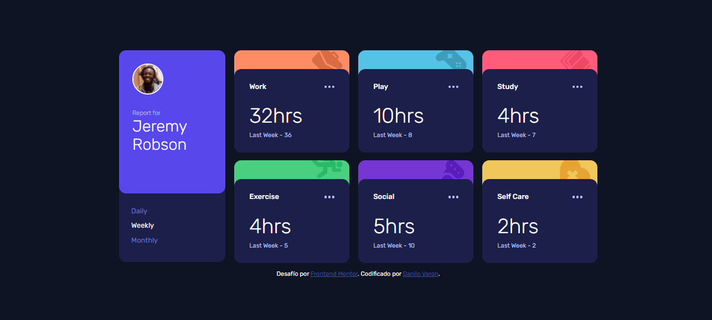
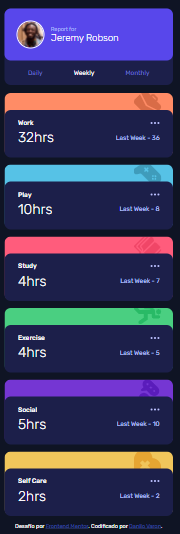

# Frontend Mentor - Time Tracking Dashboard

## Descripción general

Este fue un desafío de práctica de Frontend Mentor para mejorar las habilidades en diseño web.

### Reto

El reto fue resuelto con html, css y JavaScript con un archivo JSON

### Captura de pantalla

### Links

- URL del Sitio: [Sitio Web](https://danilovaron.github.io/Time_tracking_dashboard/)

## Proceso

Hice la semántica correspondiente de html, teniendo en cuenta las buenas practicas que conlleva el código. luego comencé con el diseño de la página, intentando comentar para que todo estuviera ordenado.

### Construido con

- Marcado semántico HTML5
- Propiedades personalizadas de CSS3

## Autor

- Sitio Web - [Portafolio Personal](https://danilovaron.github.io/Portafolio/)
- Git Hub - [@Git Hub](https://github.com/DaniloVaron)
